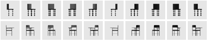
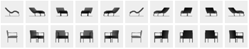

# 3D Attention-Driven Depth Acquisition for Object Identification
By Kai Xu, Yifei Shi, Lintao Zheng, Junyu Zhang, Min Liu, Hui Huang, 
Hao Su, Daniel Cohen-Or, Baoquan Chen

## Introduction
This code is a Torch implementation of an end-to-end approach for 3D attention model that selects the best views to achieve efficient object recognition. Details of the work can be found [here](http://kevinkaixu.net/projects/nbv.html).

## Citation
If you find our work useful in your research, please consider citing:	

	@article {xu_siga16,
	title = {3D Attention-Driven Depth Acquisition for Object Identification},
        author = {Kai Xu and Yifei Shi and Lintao Zheng and Junyu Zhang and Min Liu and Hui Huang and Hao Su and Daniel Cohen-Or 	 and Baoquan Chen},
     	journal = {ACM Transactions on Graphics (Proc. of SIGGRAPH Asia 2016)},
    	volume = {35},
    	number = {6},
    	pages = {to appear},
    	year = {2016}
	}

## Requirements
 1. This code is written in lua and requires [Torch](http://torch.ch/). You should setup torch environment.

 2. if you'd like to train on GPU/CUDA, you have to get the cutorch and cunn packages:
 ```
	 $ luarocks install cutorch	
	 $ luarocks install cunn
 ```
 
 3. Install matio:  ``` $ sudo apt-get install libmatio2 ```

 4. Install other torch packages (nn, dpnn, rnn, image, etc.): ```$ ./scripts/dependencies_install.sh```

## Usage 
### Data 
Here we give a small dataset to show our demo. the dataset contains five classes (chair, display, flowerpot, guita, table), each of which consists of 300 models. Each 3D model is rendered into a basic set of 2.5D depth images from 21 sampled views, serving as multi-veiw training data. We split train and test set according the ratio 5:1 for each class. The hierachy tree have been build, and was placed in the data_hierarchy_tree. In each node, there exists a folder named mvcnn, which contains a mvcnn net. A folder named cur_model, which contains a MV-RNN model for current node. A matlab format file .mat used for training data. And each subclass folder is sub-node.

### Train 
To train a MV-RNN model to classify object for current node:
```
$ th train.lua 
```
 Run `th train.lua -h` to see additional command line options that may be specified.
 
 If you want to train hierarchy MV-RNN models for every node of all classes, run:
   ./scripts/train_hierarchy_mvrnn.sh
 
### Evaluation
We have trained all models(MV-RNN models) for every node of class chair(subclass1), you can see the evaluation results following opeartions below.
To evulate the MV-RNN model for the root node:
 ```
$ th eval_demo.lua 
```
You can see retrive examples by running:
```
$ th retrive_demo.lua
```
the results are saved in the folder `retrive_res`.
<br>

### Example output by retrive_demo.lua
<br>
 1. Example of ten views comparision bettwen input and retrive data 
<br>
 <p>   first row for input data, second row for retrive data <p/>
 (1) <br><br>  
 (2) <br>

<br>
 2. Example of view sequence
<br>
 (1)<br><br> 
 (2)<br>

## Acknowledgement
Torch implementation in this repository is based on the code from Nicholas Leonard's recurrent model of visual attention, which is a clean and nice GitHub repo using Torch.

